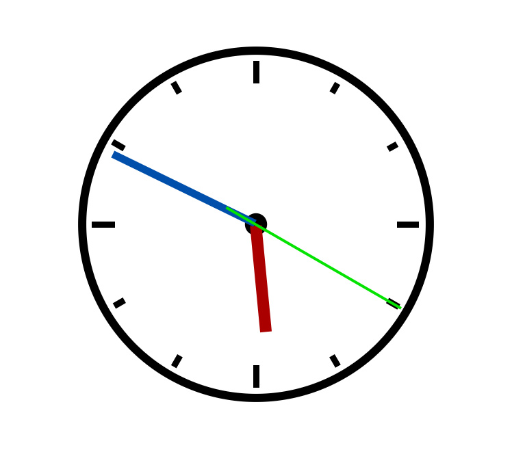

# Analog-Clock-JS

This project is a practical demo of JavaScript concepts,
use JavaScript and CSS to create a working analog clock running on the browser.

JavaScript training course by:
* **[Morten Rand-Hendriksen](https://www.linkedin.com/in/mortenrandhendriksen/?trk=lil_course)**

## Author

* **[Yann Mulonda](https://github.com/YannMjl)**

## License

This project is licensed under the MIT License - see the [LICENSE](LICENSE)© [Yann Mulonda](https://github.com/YannMjl) file for details
