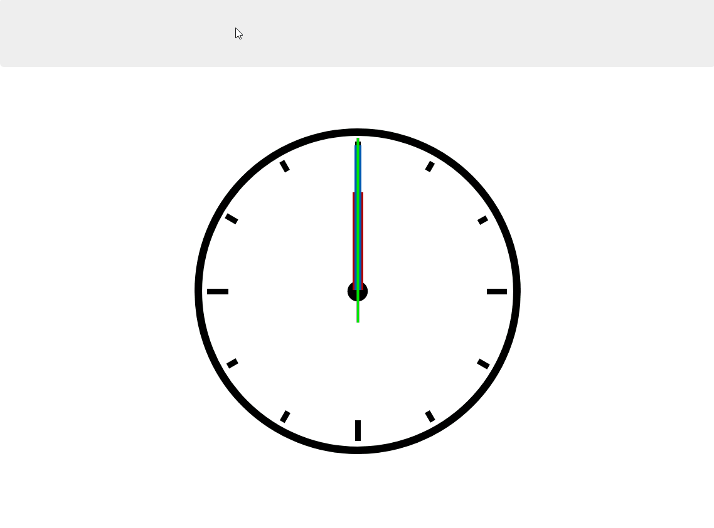

# Analog-Clock-JS

> This is a practical demo of JavaScript concepts, HTML, and CSS to create a working analog clock running on the browser.

## ScreenShot

## Environment links

* **[Dev env](https://clock-dev.netlify.app/)**
* **[Test env](https://clock-test.netlify.app/)**
* **[Prod env](https://clock-prod.netlify.app/)**

## Author

* **[Yann Mulonda](https://github.com/YannMjl)**

## License

This project is licensed under the MIT License - see the [LICENSE](LICENSE)© [Yann Mulonda](https://github.com/YannMjl) file for details.
